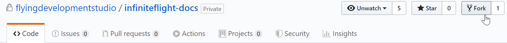
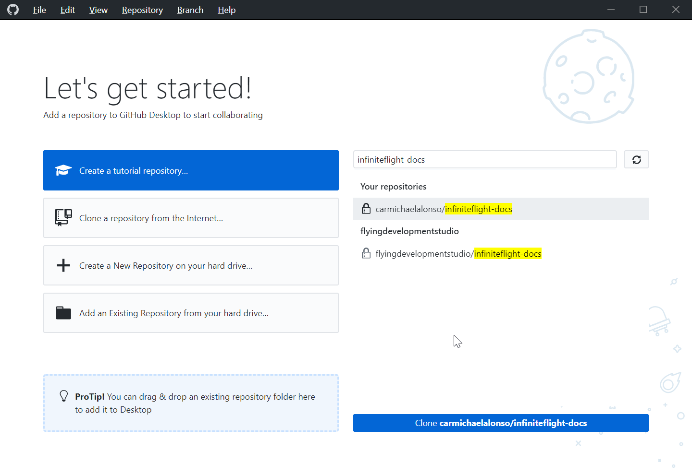
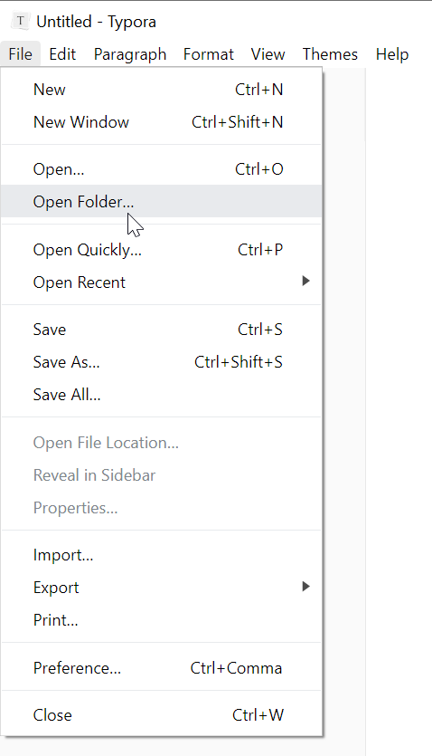
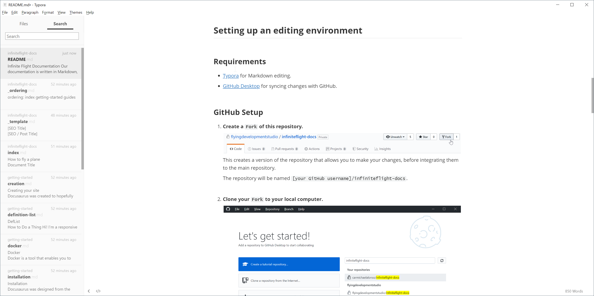
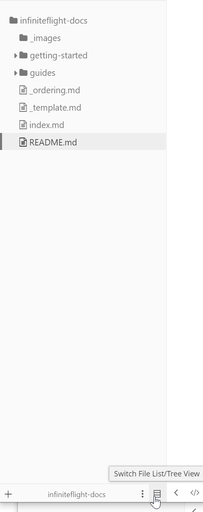
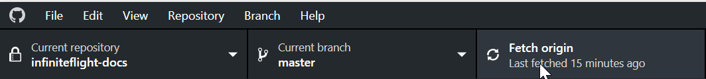
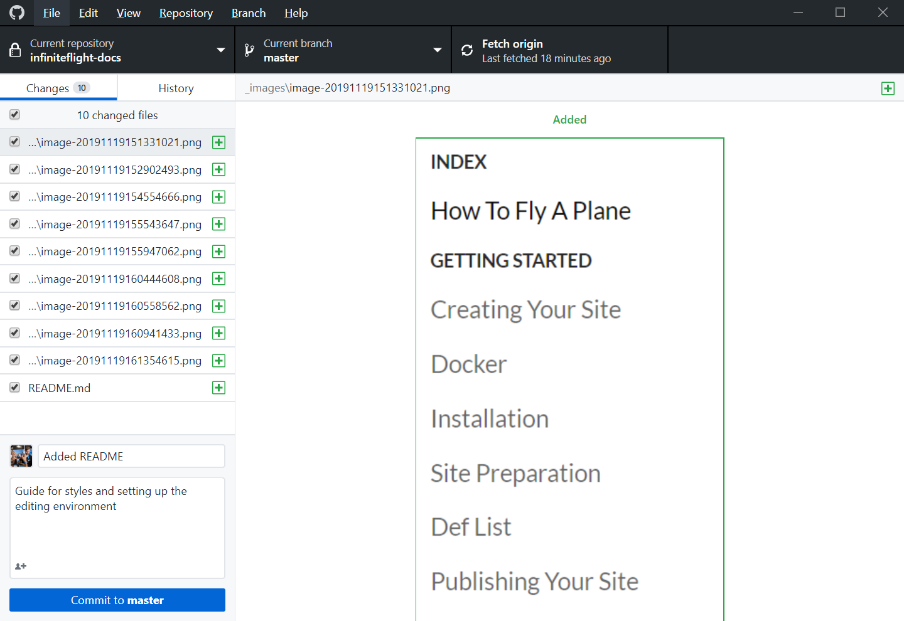
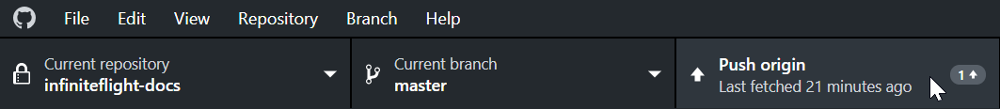
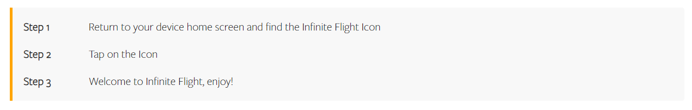
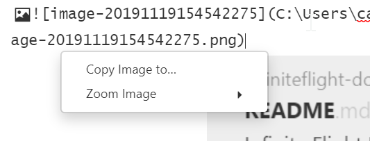

# Infinite Flight Documentation


## Overview


Our documentation is written in Markdown, hosted in GitHub and rendered using our documentation component on our website. All guides are divided into different categories for organization, these are defined below:

| Category | Definition                                                   | Repository Definition |
| -------- | ------------------------------------------------------------ | --------------------- |
| Guide    | The main category that will be listed in the navigation side bar | Folder                |
| Section  | Within each guide will be a series of sections, these are shown when clicking on a guide from the navigation side bar | Sub-Folder            |
| Page     | A page is within a section and covers a specific topic, again this can be accessed by clicking on a section from the navigation side bar to show all pages contained within that section | File                  |


> For markdown, a useful reference is the [Markdown Cheatsheet]( https://github.com/adam-p/markdown-here/wiki/Markdown-Cheatsheet )


## Community Contribution

The community can contribute to any of the guides by tapping the "Contribute on GitHub" link located at the bottom of every page of the guides. Our announcement on the IFC as well as this ReadMe document should both be consulted when making any changes to the guides to ensure compliance. 


>  Localization (i.e. providing the guides in a different language) is not currently supported and therefore only edits in US english will be accepted at this time


## Setting up an Editing Environment


### Programs to Install

The following programs are required:

- [Typora]( https://www.typora.io/ ) for Markdown editing
- [GitHub Desktop]( https://desktop.github.com/ ) for syncing changes with GitHub


### GitHub Set Up

To set up GitHub, the following steps can be followed:


Step 1

: Create a `Fork` of this repository. This creates a version of the repository that allows you to make your changes, before integrating them to the main repository. The repository will be named `[your GitHub username]/infiniteflight-docs`




Step 2

: Clone your `Fork` to your local computer. Select your forked repository (in this case, `carmichaelalonso/infiniteflight-docs`), and then press "Clone" at the bottom. Set your preferred `local path`, which is where the repository is kept on your local computer, the default option is  `Documents\GitHub\infiniteflight-docs`



### Typora Set Up

To set up Typora, the following steps can be followed:


Step 1

: Open the cloned folder in Typora



​	

Step 2

: In this case, select the `Documents\GitHub\infiniteflight-docs` folder, which will look like this

​	


Step 3

: Toggle Tree View. Tree View allows you to see all files as they are represented by section in the repository. Select any file to open it, and it will show on the right side edit pane



Step 3

: Begin writing and refer to the style guide below. You can also right click in the edit pane to select formatting options, or insert a particular Markdown element


Step 4

: Save the file at regular intervals and before pushing to GitHub. This can be done with `Ctrl + s` or `File -> Save`.


### Creating a New Guide

Step 1

: Right-click on the `infiniteflight-docs` folder


Step 2

: Create a `New Folder`


Step 3

: The name must be the same as the name of the guide, all in lower case and with `-` used for spaces


### Creating a New Section

Step 1

: Right-click on the `guide` folder


Step 2

: Create a `New Folder`


Step 3

: The name must be the same as the name of the section, all in lower case and with `-` used for spaces


### Creating a New Page

Step 1

: Right-click on a section folder


Step 2

: Create a `New File`


Step 3

: The name must be the same as the name of the page, all in lower case and with `-` used for spaces


### Pushing to GitHub

Step 1

: Ensure you have synced the latest changes. Press `Fetch Origin` in the top menu bar to see if there are new changes




> If there are changes, it will show a count of commits, alongside `Pull Changes`. Do this before continuing (this may give some errors if there are file conflicts, if so, contact Cam for help)


Step 2

: Commit your changes. Ensure all the changed files are selected (see the checkboxes on the left in the image above). Write a summary of changes (this should be short yet informative, so that we can look back at the file history at some point in the future), then press `Commit`




Step 3

: Push your changes. Press `Push origin` to push your commit to GitHub




### GitHub Definitions

| GitHub Terminology | Definition                                                   |
| ------------------ | ------------------------------------------------------------ |
| Commit             | A set of changes saved to the local repository. This can include multiple files changes, additions, deletions, etc. |
| Pushing a commit   | Syncing your local repository with GitHub. This essentially means you push your changes to our common repository |


## Style Guide

See  `_template.md` for an example on how to style a new page.


### Language

US English must be used for the documentation.


### Metadata

Every file must contain a metadata section at the top of the page, this must be styled like this:


| Metadata | Description                                                  |
| -------- | ------------------------------------------------------------ |
| id:      | Same as the file name (e.g. "flight-planning")               |
| title:   | Same as the file name however, this will appear in the navigation bar so spaces and capital letters can be used as appropriate (e.g. "Flight Planning") |
| meta:    | A description of what is contained within the page, this is also used for SEO |
| order:   | The order that the page will appear within that section (e.g. "2") |
| hidden:  | "true" should be added if this page is to be hidden from public view, and only accessible to the corresponding groups on the IFC |


**Example:** 

```markdown
id: flight-planning
title: Flight Planning
meta: Learn how to prepare for your flight in Infinite Flight.
order: 2
```


### Headings

Headings can be added by placing a series of `#` symbols before the text:

| Heading Type | Markdown Formatting | Use                                                          |
| ------------ | ------------------- | ------------------------------------------------------------ |
| Heading 1    | #                   | Used for the name of the page                                |
| Heading 2    | ##                  | Used for any sub-titles required within the page to split it into logical sections |
| Heading 3    | ###                 | A series of numbers/letters to add a reference to every paragraph within a manual (not to be used in guides) |


**Guide Example:**

```markdown
# Flight Planning
```


```markdown
## Weight & Balance
```


**Manual Example:**

> Sections within a manual will be sequentially numbered and have this in the section name (e.g. 1 Introduction, 2 Ground, etc.). Each page within a section will be sequentially numbered after the section number (e.g. 2.1 Runway Selection and Pushback, 2.2 Taxi and Use of Give Way, etc.). Within each page, every paragraph will be sequentially numbered after the section number and page number (e.g. 2.1.1, 2.1.2, 2.1.3, etc.)


```markdown
# 2.1 Runway Selection & Pushback
```


```markdown
## Runway Selection
```


```markdown
### 2.1.1
```


```markdown
### 2.1.2
```


```markdown
### 2.1.3
```


### Emphasis

Various types of emphasis can be used to draw attention to particular working:


```markdown
Emphasis, aka italics, with *asterisks* or _underscores_.

Strong emphasis, aka bold, with **asterisks** or __underscores__.

Combined emphasis with **asterisks and _underscores_**.

Strikethrough uses two tildes. ~~Scratch this.~~
```


**Example:**

>Emphasis, aka italics, with *asterisks* or _underscores_.
>
>Strong emphasis, aka bold, with **asterisks** or __underscores__.
>
>Combined emphasis with **asterisks and _underscores_**.
>
>Strikethrough uses two tildes. ~~Scratch this.~~


### Bullet Points

Bullet point lists can be defined to specify chunks of information (a sentence should be used first to describe what the bullet point list contains, followed by a semi colon and then the bullet point list, no full stops should be used).


**Example:**

```markdown
A Temporary Flight Restriction, referred to as a TFR, is a block of airspace that has had restrictions put in place. In real life this could be due to numerous factors such as:

- movement of government officials
- natural disasters
- or other special events
```


### Blockquotes

Blockquotes are used for "notes" using the following markdown:

```markdown
> Insert note
```


**Example:**

> Insert note


### Step by Step Guides

Step by step guides are used to show a process and how to complete it.


**Example:**

```markdown
Step 1
: Return to your device home screen and find the Infinite Flight icon

Step 2
: Tap on the icon
        
Step 3
: Welcome to Infinite Flight, enjoy!
```




### Hyperlinks

Links to other parts of the guides is defined by `/guide/guide-name/section-name/file-name`.

**Example:**

```markdown
See the [android installation guide](/guide/getting-started-guide/installing-the-app/android) for more information.
```

> See the [android installation guide](/guide/getting-started-guide/installing-the-app/android) for more information.


Links to other pages, such as the community is defined by the URL for that page.

**Example:**

```markdown
See the [tutorial](https://community.infiniteflight.com/t/infinite-flight-faq/288495) on the IFC.
```

>See the [tutorial](https://community.infiniteflight.com/t/infinite-flight-faq/288495) on the IFC.


Any links within a manual to another part of the manual should always reference "heading 3".

**Example:**

```markdown
*(see [3.2.3](/guide/atc-manual/3.-tower/3.2-departures#3.2.3) below)*
```

>*(see [3.2.3](/guide/atc-manual/3.-tower/3.2-departures#3.2.3) below)*


### Images

Images need to included in the `_images` directory so that they are pushed to the repository, and referenced in the documentation with a relative path (that is, `_images/`, followed by the name of the image). Additionally, `Alternative Text` needs to be provided to summarize what the image is, in a couple of words for those who are hard of sight (as it can be read out by a screen reader). It also shows in the case the image isn't available.

```markdown

```

> 


Step 1:

If you are using Typora, it is recommended that you paste in an image, then use the `Copy Image To...` function (shown when you paste the image, or by right-clicking on the image)





Step 2

: Make sure the path begins with `_images/`


### Tables

Tables are used to tabulate any data using the following markdown:

```markdown
| Category        | Aircraft Types                  | Speed Range (M) |
| --------------- | ------------------------------- | --------------- |
| Turbo Prop      | e.g. TBM-930, Dash-8 Q400 etc   | .51 - .53       |
| Narrow Body Jet | e.g. CRJ, E-Jet, A320, B737 etc | .75 - .80       |
| Wide Body Jet   | e.g. A330, B777, MD-11 etc      | .82 - .85       |
```


**Example:**

| Category        | Aircraft Types                  | Speed Range (M) |
| --------------- | ------------------------------- | --------------- |
| Turbo Prop      | e.g. TBM-930, Dash-8 Q400 etc   | .51 - .53       |
| Narrow Body Jet | e.g. CRJ, E-Jet, A320, B737 etc | .75 - .80       |
| Wide Body Jet   | e.g. A330, B777, MD-11 etc      | .82 - .85       |


### Hidden Section

A hidden section can be added to prevent all information being displayed immediately on the page being loaded, this can then be opened by the reader if they wish to access it. This can be done using the following markdown:

```markdown
+++ CYTZ (Toronto City Billy Bishop)

Aircraft larger than Dash-8 Q400 not authorized. Jet traffic not authorized. Larger aircraft MUST divert.

| Parameters | Restrictions |
| ---------- | ------------ |
| Type       | NOTAM        |
| Status     | ACTIVE       |
| Floor      | SFC          |
| Ceiling    | 10,000ft     |

+++

+++ EGKK (London Gatwick)

RWY 08L/26R CLOSED. RWY08L/26R to be used as taxiway ONLY.

| Parameters | Restrictions |
| ---------- | ------------ |
| Type       | NOTAM        |
| Status     | ACTIVE       |
| Floor      | SFC          |
| Ceiling    | 10,000ft     |

+++
```


**Example:**

+++ CYTZ (Toronto City Billy Bishop)

Aircraft larger than Dash-8 Q400 not authorized. Jet traffic not authorized. Larger aircraft MUST divert.

| Parameters | Restrictions |
| ---------- | ------------ |
| Type       | NOTAM        |
| Status     | ACTIVE       |
| Floor      | SFC          |
| Ceiling    | 10,000ft     |

+++


+++ EGKK (London Gatwick)

RWY 08L/26R CLOSED. RWY08L/26R to be used as taxiway ONLY.

| Parameters | Restrictions |
| ---------- | ------------ |
| Type       | NOTAM        |
| Status     | ACTIVE       |
| Floor      | SFC          |
| Ceiling    | 10,000ft     |

+++


### FontAwesome Icons

FontAwesome icons are available and can be found at [FontAwesome](https://fontawesome.com/icons). For example, the [Clipboard Check](https://fontawesome.com/icons/clipboard-check?style=solid) icon has a class attribute of `fas fa-clipboard-check`. To use this in the documentation, use the following markdown:

```markdown
:fa-clipboard-check:
```


### Scenarios

HTML Containers (div) can be added by wrapping content in `:::`.  Scenarios are usually contained within a hidden section to ensure that it is clear what is applicable to that scenario. For scenarios, `scenario-heading` and `scenario` are used to add scenario styling:

```markdown
::: scenario-heading
Scenario
:::

::: scenario
Insert a brief description of the scenario.
:::
```


This is then followed by tables which have the class attributes `{.technique}` and `{.prosandcons}`. This allows us to create connected tables, provided no extra paragraph breaks are in between. These will have special styles applied to the table classes for easy viewing:

```markdown
| Technique 1                                                 |
| ------------------------------------------------------------|
| 1. Insert step 1 | 
| 2. Insert step 2 |
{.technique}
| Technique 1                                                  | Pro or Con?                       |
| ------------------------------------------------------------ | --------------------------------- |
| :fa-check-circle: | Insert pro |
| :fa-times-circle: | Insert con |
{.prosandcons}
```


### Task Lists

Tasks lists can be added using the following markdown:

```markdown
- [ ] List item number one
- [ ] List item number two
- [x] List item number three, which is checked by default
```


## Special Page Properties

### Hiding Pages from the Side Menu

Individual pages can be hidden from the side menu navigation while still being accessible via direct URL. This is useful for:
- Internal documentation pages
- Pages under development
- Supplementary content that doesn't need to be in the main navigation
- Special purpose pages that are only relevant in specific contexts

To hide a page from the side menu, add the `hideFromSideMenu: true` property to the frontmatter of the markdown file:

```markdown
---
id: your-page-id
title: Your Page Title
meta: Your page description
hideFromSideMenu: true
---
```

The page will still be accessible via direct URL and can be linked to from other pages, but it will not appear in the sidebar navigation.

There is a template for hidden pages available at `_hidden_page_template.md` that you can use as a starting point.


