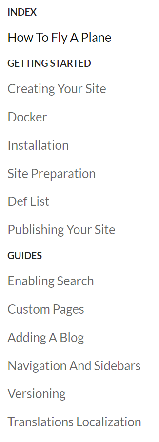

# Infinite Flight Documentation


Our documentation is written in Markdown, hosted in GitHub and rendered using our documentation component on our website.


## Definitions

- **Section**

  This is a top-level category that is listed in the sidebar. Examples here are "Getting Started" and "Guides".

  A Section is defined in the repository as a folder.

   

- **Article**

  An individual article discuses a specific subject in the category. This is an individual markdown file within the category folder.

  For example, an "Installing the App" article can exist within the "Getting Started" section.

- **Sub-Section**

  A section within an article contained in a markdown file, defined by a second-level header (`## `).

  For example, "Installing on Android" within the "Installing the App" section.
  
- **Commit**

  A set of changes saved to the local repository. This can include multiple files changes, additions, deletions, etc.

- **Pushing a commit**

  Syncing your local repository with GitHub. This essentially means you push your changes to our common repository.


## Setting up an editing environment


### Requirements

- [Typora]( https://www.typora.io/ ) for Markdown editing.
- [GitHub Desktop]( https://desktop.github.com/ ) for syncing changes with GitHub.


### GitHub Setup

1. **Create a `Fork` of this repository.**

   

   This creates a version of the repository that allows you to make your changes, before integrating them to the main repository. 

   The repository will be named `[your GitHub username]/infiniteflight-docs`.

   

2. **Clone your `Fork` to your local computer.**

   

   ​	Select your forked repository (in this case, `carmichaelalonso/infiniteflight-docs`), and then press **"Clone"** at the bottom.

   Set your preferred `local path`, which is where the repository is kept on your local computer, the default option is  `Documents\GitHub\infiniteflight-docs` which is what I am using.


###  Typora Setup

1. **Open the cloned folder in Typora.**

   

   ​	In my case, I select the ``Documents\GitHub\infiniteflight-docs` folder, which will look like this:

   ​	

   

2. **Toggle Tree View**.

   

   ​	Tree View allows you to see all files as they are represented by section in the repository.

   ​	Select any file to open it, and it will show on the right side edit pane.

   

3. **Begin writing!**

   Refer to the style guide below. You can also right click in the edit pane to select formatting options, or insert a particular Markdown element.

   

4. **Save the file at regular intervals and before pushing to GitHub.**

   This can be done with `Ctrl + s` or `File -> Save`.


### Creating a new section

1. Right-click on the `infiniteflight-docs` folder.
2. Create a `New Folder`.
3. Name it appropriately for the section. The section name is taken by replacing `-` dashes with a space, and capitalising the first letter of each word.


### Creating a new article

1. Right-click on a section folder.
2. Create a `New File`.
3. Name it appropriately:
   - Do not use spaces in the file name, use `-` (dashes) instead.
   - Relate it to the document title as much as possible.


### Pushing to GitHub

1. **Ensure you have synced the latest changes.**

   Press `Fetch Origin` in the top menu bar to see if there are new changes.

   

   *If there are changes*, it will show a count of commits, alongside `Pull Changes`. Do this before continuing (this may give some errors if there are file conflicts, if so, contact Cam for help).

   

2. **Commit your changes.**

   

   

   1. Ensure all the changed files are selected (see the checkboxes on the left in the image above).

   2. *Write a summary of changes*. This should be short yet informative, so that we can look back at the file history at some point in the future.

   3. _Press `Commit`_.

      

3. **Push your changes**.

   

   Press `Push origin` to push your commit to GitHub.


## Style Guide

See  `_template.md` for an example on how to style a new article.


1. **US English must be used for the documentation.** It will hurt to write `z` so much, but it is a requirement as the company is US-based. Sorry in advance.

   

2. **Every article must contain a metadata section at the top of the file.**


   ```markdown
   ---
   id: getting-started
   title: Getting Started
   meta: Learn how to start a flight in Solo with Infinite Flight
   ---
   ```

   This must define these tags which are used for search engine / open graph listings. Provide a unique `id` and `title`, as well as a `meta` description of what the article is about.


3. **Every article must contain a document title.** This is a top-level header, specified with one `#`.

   ```markdown
   # Getting Started
   ```

   

4. **Sections in each article must contain a second-level header**, specified with two `#`.

   ```markdown
   ## Opening the app
   ```

   

5. **Further sections can be defined by including an additional `#`.**

   ```markdown
   ### Minimum requirements
   ```

   

6. **Emphasis can be defined to draw attention to particular wording.**

   ```markdown
   Emphasis, aka italics, with *asterisks* or _underscores_.
   
   Strong emphasis, aka bold, with **asterisks** or __underscores__.
   
   Combined emphasis with **asterisks and _underscores_**.
   
   Strikethrough uses two tildes. ~~Scratch this.~~
   ```

   >Emphasis, aka italics, with *asterisks* or _underscores_.
   >
   >Strong emphasis, aka bold, with **asterisks** or __underscores__.
   >
   >Combined emphasis with **asterisks and _underscores_**.
   >
   >Strikethrough uses two tildes. ~~Scratch this.~~

   

7. **Bullet point lists can be defined to specify chunks of information, such as a section summary**.

   ```markdown
   * A plane is made out of metal and other strong materials.
   * Infinite Flight simulates planes and the look is based on the physical properties of the aircraft's material.
   ```

   > * A plane is made out of metal and other strong materials.
   > * Infinite Flight simulates planes and the look is based on the physical properties of the aircraft's material.

   

8. **Definition lists can show a list of steps in how to carry out a feature.**

   ```markdown
   Step 1
   : Return to your device home screen and find the Infinite Flight icon
   
   Step 2
   : Tap on the icon
           
   Step 3
   : Welcome to Infinite Flight, enjoy!
   ```

   

   

9. **Links to other articles are defined by the name of the section and the article.** 

   For example, a link the "installation" article in the "getting-started" section is done as follows:

   ```markdown
   See the [installation guide](getting-started/installation) for more information.
   ```

   > See the [installation guide](getting-started/installation) for more information.

   

   Links to other pages, such as the community, are defined as:

   ```markdown
   See the [tutorial](https://community.infiniteflight.com/t/infinite-flight-faq/288495) on the IFC.
   ```

   >See the [tutorial](https://community.infiniteflight.com/t/infinite-flight-faq/288495) on the IFC.

   It's best if links to pages outside of the documentation are ran by Cam/Jason.

   

10. **Images need to included in the `_images` directory so that they are pushed to the repository, and referenced in the article with a relative path** (that is, `_images/`, followed by the name of the image).

    Additionally, `Alternative Text` needs to be provided. This summarises the image in a couple of word for those who are hard of sight, as it can be read out by a screen reader. It also shows in the case the image isn't available.

    ```markdown
    
    ```

    > 

    If you are using Typora, it is recommended that you paste in an image, then use the `Copy Image To...` function (shown when you paste the image, or by right-clicking on the image).

    Make sure the path is **relative**, that is, it must begin with `_images/`.

    
    
11. **HTML Containers (div) can be added by wrapping content in `:::`***
    
    Our customized markdown has some styles associated with these containers for scenario headings and scenarios like so:
    
    ```markdown
    ::: scenario-heading
    This is my heading
    :::
    
    ::: scenario
    This is a longer description of the scenario [...]
    :::
    ```

12. **Technique and associated Pros/Cons tables**

    Using the class attributes `{.technique}` and `{.prosandcons}` allows us to create connected tables, provided no extra paragraph breaks are in between. These will have special styles applied to the table classes for easy viewing.
    
    ```markdown
    | Technique 1                                                 |
    | ------------------------------------------------------------|
    | Try to anticipate the problem by creating separation sooner rather than later | 
    | E.g. if both aircraft were downwind, rather than allowing *I-DRUM* to follow *N1DC* with [...] |
    {.technique}
    | Technique 1                                                  | Pro or Con?                       |
    | ------------------------------------------------------------ | --------------------------------- |
    | :fa-check-circle: | Could prevent a go-around |
    | :fa-times-circle: | May increase workload |
    {.prosandcons}
    ```

13. **FontAwesome Icons**

    As shown in point 12, FontAwesome icons are available, who's class name can be found at [FontAwesome](https://fontawesome.com/icons). For example, the [Clipboard Check](https://fontawesome.com/icons/clipboard-check?style=solid) icon has a class attribute of `fas fa-clipboard-check`. To use this in the documentation, use the following markdown:
    
    ```markdown
    :fa-clipboard-check:
    ```


A useful reference is the [Markdown Cheatsheet]( https://github.com/adam-p/markdown-here/wiki/Markdown-Cheatsheet ).